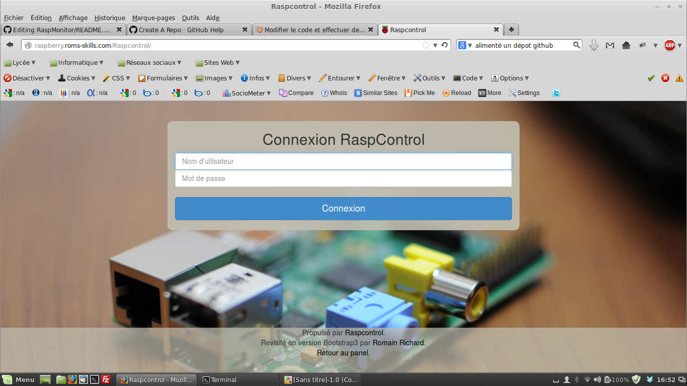

# RaspMonitor

RaspMonitor est une application web en PHP qui permet de monitorer un RaspBerry Pi.

***

## Installation

Pour utiliser cette application, tu n'as besoin que d'un serveur web installé sur ton Raspberry Pi.

Il te suffit juste de cloner le dépôt dans ton répertoire web (www) avec la commande suivante: 
	
	git clone https://github.com/richardromain/RaspMonitor.git raspmonitor

Enfin tu dois créer un fichier JSON pour l'authentification `/etc/raspcontrol/database.aptmnt` avec les droits d'accès 740 et un propriétaire appartenant au groupe www-data:

	{
 	   "user":       "yourName",
 	   "password":   "yourPassword"
	}
